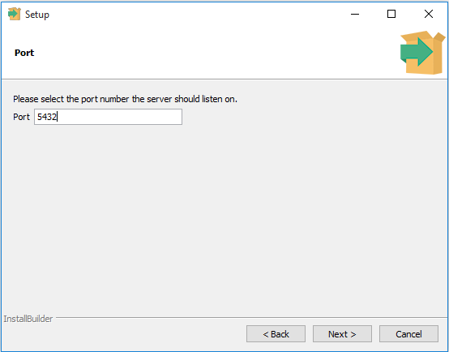

安裝PostgreSQL
==============

.. note::
    在本節中，我們將介紹如何在本機端的系統上\ **安裝PostgreSQL**\ ，以學習和實踐PostgreSQL。

PostgreSQL是為UNIX-like平台開發的，但它被設計成可以移植。這意味著PostgreSQL也可以運行在其他平台上，例如MacOS X，Solaris和Windows。

自8.0版以來，PostgreSQL為Windows系統提供了一個安裝精靈，使安裝過程變得既簡單又快速。為了開發目的，我們將在Windows 10上安裝PostgreSQL 9.5版本。

.. note::
    如果您正在使用Windows 8和Windows 10，則需要建立具有管理員權限
    的Windows帳號，例如postgres，並使用此帳號執行安裝程式。有關詳細
    信息，請參閱下面的故障排除部分。

PostgreSQL完整安裝有三個步驟：

1. 下載Windows版的PostgreSQL安裝程式

2. 安裝PostgreSQL

3. 驗證安裝

下載Windows版的PostgreSQL安裝程式
---------------------------------

您需要從PostgreSQL官方網站下載安裝程式。

-  進入PostgreSQL官方網站，下載Windows版的安裝程式\ http://www.postgresql.org/download/windows/

-  `從EnterpriseDB中 <http://www.enterprisedb.com/products/pgdownload.do#windows>`__\ 選擇作業系統版本，然後點選\ `下載安裝程式 <http://www.enterprisedb.com/products/pgdownload.do#windows>`__

-  選擇要下載的最新版本。完成下載需要幾分鐘的時間。

安裝PostgreSQL
--------------

雙擊安裝程式會出現一個安裝精靈，透過多個步驟引導，選擇您希望在PostgreSQL中使用的不同選項。

|image0|

以下說明每個步驟及其安裝選項。如果您安裝不同的版本，您可能會得到額外的步驟。

1. 開始安裝PostgreSQL

|image1|

2. 指定安裝資料夾。您可以選擇您自己指定的資料夾，或保留PostgreSQL
   安裝程式建議的預設資料夾。

輸入資料庫superuser的密碼。

|image2|

3. 輸入PostgreSQL的連接埠。請確認沒有其他應用程序正在使用此連接埠。
   如果您不確定，請將其保留為預設值。

|image3|

4. 選擇資料庫使用的預設語系。

|image4|

5.您已完成提供PostgreSQL安裝程式資訊的步驟。點擊Next按鈕開始安裝
  PostgreSQL。

|image5|

6. 安裝可能需要幾分鐘的時間才能完成。

|image6|

7. 點擊Finish按鈕完成PostgreSQL的安裝。

驗證安裝
--------

有幾種方法可以驗證PostgreSQL是否安裝成功。您可以嘗試從任何客戶端應用程式（例如psql和pgAdmin）\ `連接到PostgreSQL <http://www.postgresqltutorial.com/connect-to-postgresql-database/>`__\ 資料庫伺服器。

驗證安裝最快速的方法是使用pgAdmin應用程序。

1. 首先，點選pgAdmin III啟動它。pgAdmin III GUI將顯示。

|image7|

|image8|

2. 在Object browser上雙擊 PostgreSQL9.5，它會問你管理員密碼。
   只需輸入您在安裝步驟中設定的密碼。

|image9|

3. 如果一切正常，pgAdmin將顯示屬於伺服器的所有物件。

|image10|

恭喜！您已經在本機系統上成功安裝了PostgreSQL資料庫伺服器。讓我們
學習連接到PostgreSQL數據庫服務器的各種方法。

故障排除
--------

如果在Windows作業系統（Windows 8或Windows 10）中安裝PostgreSQL時收到以下錯誤訊息：

.. warning:: 
    Failed to load sql modules into the database cluster

並顯示以下錯誤訊息：

.. warning::
    Error running post install step. Installation may not complete
    correctly. Error reading C:/Program Files/PostgreSQL/9.5/postgresql.conf

您需要執行以下步驟：

1. 移除PostgreSQL，並刪除安裝資料夾中的Data目錄。

2. 建立一個新的Windows帳號，名稱為postgres，並將它加入到管理員群組。

3. 重啟你的電腦。

4. 打開cmd（命令提示字元），使用以下指令作為postgres指令： 
   ```runas /user:postgres cmd.exe```

5. 出現一個新視窗，您需要從該視窗執行安裝程式檔案。



.. |image4| image:: ../../images/section01/Install/01/image5.png
   :width: 4.33071in
   :height: 3.37296in


.. |image7| image:: ../../images/section01/Install/01/image8.jpeg
   :width: 2.58333in
   :height: 2.95833in
.. |image8| image:: ../../images/section01/Install/01/image9.jpeg
   :width: 4.33071in
   :height: 2.40870in
.. |image9| image:: ../../images/section01/Install/01/image10.jpeg
   :width: 4.33071in
   :height: 2.94990in

